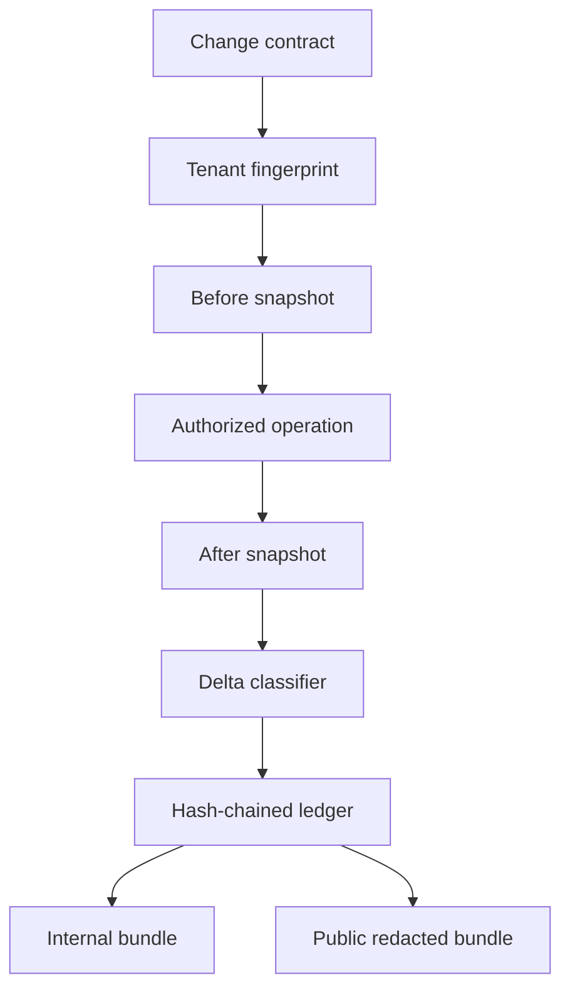

# Architecture

ChangePack365 separates evidence lifecycle from provider-specific collection.

## Boundaries

- The core module does not request Microsoft Graph permissions.
- Providers collect snapshots and remain independently reviewable.
- The contract declares intent before evidence is captured.
- `ControlledWrite` validates context but never grants authorization.
- The public exporter uses case-scoped deterministic pseudonyms so repeated identifiers remain correlatable without exposing the original value.

## Evidence integrity

Every ledger entry contains the previous entry hash, a canonical payload hash, and its own entry hash. This makes modification, deletion, and reordering detectable. It is tamper-evident, not immutable: stronger non-repudiation requires the planned certificate-signed manifest.
